# Árvore de Segmentos: Uma Análise de Desempenho em Java, Python, C++ e Rust

**Universidade Federal de Campina Grande**
Centro de Engenharia Elétrica e Informática
Unidade Acadêmica de Sistemas e Computação
Curso de Bacharelado em Ciência da Computação

**Autores:**
Pedro Almeida Candido
Miquéias Henderson da Silva Santos
Luis Guilherme Brito Ceglia Araujo
Luis Henrique Rêgo Leite

**Orientador:** Prof. Dr. João Arthur Brunet Monteiro

Relatório apresentado como requisito para obtenção de nota na disciplina Estrutura de Dados e Algoritmos, no Curso de Ciência da Computação, na Universidade Federal de Campina Grande.

Campina Grande, 2026

---

## Resumo

Este relatório apresenta uma análise comparativa do desempenho da estrutura de dados Segment Tree implementada em quatro linguagens de programação com paradigmas distintos: Java, Python, C++ e Rust. O objetivo central foi analisar como cada linguagem influencia na eficiência de execução das operações fundamentais como construção, atualização e consulta (build, update e query respectivamente). A metodologia consistiu na execução de experimentos em um ambiente isolado utilizando a ferramenta Docker, com cargas de trabalho padronizadas e métricas de tempo de execução e número de nós visitados.

Os resultados obtidos confirmam que, ainda que o comportamento assintótico *O(log N)* seja preservado em todas as implementações, há variações significativas no desempenho absoluto. As linguagens de compilação direta como C++ e Rust apresentaram os tempos mais reduzidos, seguidos de Java, cujo desempenho é otimizado pelo JIT, enquanto Python demonstrou ser a opção com maior custo computacional. Além disso, a análise das distribuições de dados demonstrou que a Segment Tree apresenta estabilidade de desempenho, independentemente do padrão dos dados de entrada.

**Palavras-chave:** Estruturas de Dados, Segment Tree, Análise de Desempenho, Linguagens de Programação.

## Abstract

This report presents a comparative performance analysis of the Segment Tree data structure implemented in four programming languages representing distinct paradigms: Java, Python, C++, and Rust. The primary objective was to assess how each language influences the execution efficiency of fundamental operations, specifically construction, update, and query. The methodology involved conducting experiments in an isolated environment using Docker, employing standardized workloads and measuring execution time and the number of nodes visited.

The results confirm that, while the *O(log N)* asymptotic behavior is preserved across all implementations, there are significant variations in absolute performance. Compiled languages such as C++ and Rust exhibited the fastest execution times, followed by Java, whose performance is optimized by JIT compilation, while Python proved to be the most computationally expensive option. Furthermore, the analysis of data distributions demonstrated that the Segment Tree maintains stable performance regardless of the input data pattern.

**Keywords:** Data Structures, Segment Tree, Performance Analysis, Programming Languages.

---

## Lista de Tabelas

- Tabela 1 - Validação do número de nós visitados por carga

## Lista de Figuras

- Figura 1 – Tempo de Construção (Build) em Escala Log-Log
- Figura 2 - Tempo de Construção (Build) por Tamanho do Array
- Figura 3 - Curva de Tempo por Operação (Update - Lote de 5N)
- Figura 4 - Curva de Tempo por Operação (Update - Lote de 1N)
- Figura 5 - Curva de Tempo por Operação (Query - Lote de 5N)
- Figura 6 - Curva de Tempo por Operação (Query - Lote de 1N)
- Figura 7 - Curva de Tempo por Operação (Mixed - Lote de 5N)
- Figura 8 - Curva de Tempo por Operação (Mixed - Lote de 1N)
- Figura 9 - Comparação de Estabilidade: Atualizações (Update - 5N)
- Figura 10 - Comparação de Estabilidade: Consultas (Query - 5N)
- Figura 11 - Comparação de Estabilidade: Operações Mistas (Mixed - 5N)
- Figura 12 - Comparação de Estabilidade: Tempo de Build

## Sumário

- [1. Introdução](#1-introdução)
- [2. Desenvolvimento](#2-desenvolvimento)
  - [2.1 Referencial Teórico](#21-referencial-teórico)
    - [2.1.1 Árvore de Segmentos e Lazy Propagation](#211-árvore-de-segmentos-e-lazy-propagation)
    - [2.1.2 Linguagens Comparadas (Java, Python, C++, Rust)](#212-linguagens-comparadas-java-python-c-rust)
  - [2.2 Objetivos](#22-objetivos)
    - [2.2.1 Objetivo Geral](#221-objetivo-geral)
    - [2.2.2 Objetivos Específicos](#222-objetivos-específicos)
  - [2.3 Metodologia](#23-metodologia)
    - [2.3.1 Pergunta de Pesquisa](#231-pergunta-de-pesquisa)
    - [2.3.2 Carga de Trabalho](#232-carga-de-trabalho)
    - [2.3.3 Procedimento de Medição](#233-procedimento-de-medição)
    - [2.3.4 Métricas](#234-métricas)
  - [2.4 Procedimentos Experimentais](#24-procedimentos-experimentais)
    - [2.4.1 Ambiente e Isolamento](#241-ambiente-e-isolamento)
    - [2.4.2 Orquestração e Coleta de Dados](#242-orquestração-e-coleta-de-dados)
  - [2.5 Resultados](#25-resultados)
    - [2.5.1 Tempo de Construção (Build)](#251-tempo-de-construção-build)
    - [2.5.2 Desempenho das Operações em Lote](#252-desempenho-das-operações-em-lote)
    - [2.5.3 Impacto das Distribuições dos Dados](#253-impacto-das-distribuições-dos-dados)
  - [2.6 Ameaças à Validade](#26-ameaças-à-validade)
- [3. Conclusões](#3-conclusões)
- [Referências](#referências)

---

## 1. Introdução

O estudo desenvolvido tem como objetivo analisar o desempenho da Segment Tree em diferentes linguagens de programação, tomando por métrica o tempo de execução para suas operações principais e a quantidade de nós visitados. Entre as diversas estruturas de dados existentes, a Árvore de segmentos se destaca por permitir a realização eficiente de operações sobre intervalos, como consultas e atualizações, sendo amplamente utilizada em problemas que envolvem grandes volumes de dados.

Entretanto, o desempenho de uma mesma estrutura de dados pode variar de acordo com a linguagem de programação utilizada, devido a fatores como gerenciamento de memória, mecanismos de execução, otimizações do compilador e características da própria linguagem.

Dessa maneira, este relatório apresenta os resultados obtidos por meio dos experimentos realizados com as implementações da Segment Tree em Python, Rust, Java e C++, tendo como foco a comparação dos tempos de execução de suas principais operações.[^1]

[^1]: O código-fonte completo, scripts de orquestração e os dados brutos estão disponíveis em: https://github.com/Predd0o/SegmentTree_Benchmarking. Acesso em: 7 ago. 2026.

## 2. Desenvolvimento

### 2.1 Referencial Teórico

#### 2.1.1 Árvore de Segmentos e Lazy Propagation

A estrutura de dados Segment Tree ("Árvore de Segmentos") é uma estrutura que consegue realizar consultas e atualizações (tanto em valores pontuais como em intervalos de um array). Operações essas que são executadas em *O(log n)* (CP-ALGORITHMS, [s.d.]).

A Segment Tree é construída a partir de um array inicial de tamanho *n*. De modo geral, pode-se dizer que a construção acontece da seguinte maneira: a cada dois valores no array inicial é criado um nó pai e assim por diante até que seja finalizada a raiz, ou seja, é um agrupamento de dois em dois de baixo para cima. Quanto ao armazenamento desses nós pais, eles são guardados em outro array e indexados da seguinte forma: a raiz possui índice igual a 1 e, para qualquer nó de índice i com filhos, o filho à esquerda está em 2 · i e o filho à direita em 2 · i + 1 (CP-ALGORITHMS, [s.d.]).

Foram implementadas 3 formas da Segment Tree, diferenciadas pela informação que cada uma guarda em seus nós, são elas: Segment Tree da Soma, do Máximo e do Mínimo. Em conformidade com seus nomes, os nós de cada uma das árvores guardam a soma, o máximo e o mínimo de seus nós filhos, respectivamente.

As implementações possuem uma otimização denominada "Lazy Propagation" que, em tradução direta, significa "Propagação Preguiçosa". Essa otimização é responsável por evitar percorrer desnecessariamente a árvore, haja vista que, diante de um valor a ser atualizado nas folhas, essa atualização é feita nos pais e só chega às folhas caso alguma operação percorra o caminho necessário para isso. De modo geral, os nós pais que possuem filhos a serem atualizados recebem a devida atualização e são marcados para que, em uma nova operação que passe pelos seus filhos, estes sejam atualizados (CP-ALGORITHMS, [s.d.]).

#### 2.1.2 Linguagens Comparadas (Java, Python, C++, Rust)

Python é uma linguagem de programação interpretada e de alto nível, reconhecida por sua sintaxe simples e alta produtividade no desenvolvimento de software. Sua execução ocorre por meio de um interpretador em tempo de execução, o que elimina a etapa de compilação para código de máquina, mas resulta em um desempenho inferior ao de linguagens compiladas, como C++, Java e Rust, especialmente em aplicações que exigem intenso processamento computacional. Apesar disso, Python oferece gerenciamento automático de memória e tipagem dinâmica, simplificando o desenvolvimento e reduzindo a complexidade do código.

Quanto a Java, é uma linguagem reconhecida por oferecer um bom equilíbrio entre desempenho e portabilidade, oferecendo velocidade e segurança graças à JVM (Java Virtual Machine) e as otimizações realizadas pela compilação Just-In-Time (JIT), com desempenho elevado para aplicações gerais, embora fique abaixo de linguagens de compilação direta, como C e C++. Ainda assim, supera linguagens interpretadas devido às otimizações realizadas pela JVM. Além disso, o código Java é compilado para bytecode, permitindo que uma mesma aplicação seja executada em diferentes sistemas operacionais sem modificações.

Referente ao C++, trata-se de uma linguagem compilada que gera código de máquina nativo, permitindo que os programas sejam executados diretamente pelo sistema operacional, sem a necessidade de uma máquina virtual ou interpretador. Essa característica proporciona alto desempenho e baixa sobrecarga durante a execução, tornando-a uma das principais escolhas para aplicações que exigem alta eficiência computacional. Além disso, o C++ oferece controle direto sobre recursos do sistema e gerenciamento de memória, permitindo implementações altamente otimizadas. A linguagem também suporta diferentes paradigmas de programação, como o procedural, orientado a objetos e genérico, flexibilizando o desenvolvimento de estruturas de dados e algoritmos de alto desempenho.

O Rust é uma linguagem compilada que gera código de máquina executado diretamente pelo sistema operacional, assim como C++, que lhe dá um desempenho elevado e mínima sobrecarga de execução.

A sua principal diferença em relação às outras linguagens é seu modelo de Ownership, as regras de Borrowing e os Lifetimes (KLABNIK; NICHOLS, 2023). O Ownership garante que cada dado na memória tenha um único dono e seja liberado automaticamente ao sair do escopo, o Borrowing permite acessos temporários a esses dados via referências, e os Lifetimes garantem, em tempo de compilação, que essas referências permaneçam válidas. Com esses três pilares temos a segurança de uma linguagem com gerenciamento automático de memória e a performance de linguagens de compilação direta, ou seja, sem o uso de um coletor de lixo ou erros como dangling pointers e use-after-free, erros ocasionados por um mau gerenciamento de memória.

### 2.2 Objetivos

#### 2.2.1 Objetivo Geral

Analisar comparativamente o desempenho de uma Árvore de Segmentos (Segment Tree) com suporte a consultas de soma, mínimo e máximo em intervalo, além de atualização pontual e atualização de intervalo via lazy propagation, implementada de forma algoritmicamente equivalente em quatro linguagens de programação com paradigmas de execução distintos: Java (compilada para bytecode, executada em JVM com JIT); Rust e C++ (compiladas nativamente, sem virtual machine) e Python (interpretada). A fim de investigar em que medida as características de cada linguagem influenciam o tempo de execução das operações fundamentais da estrutura, mantendo fixos o algoritmo, os dados de entrada e o ambiente de execução.

#### 2.2.2 Objetivos Específicos

- Implementar a Árvore de Segmentos com lógica algorítmica equivalente, com as mesmas cinco operações (build, updatePoint, updateRange, querySum, queryMin/queryMax) nas quatro linguagens de programação avaliadas, validando cada implementação com a implementação base implementada em Java.
- Padronização a medição, garantindo que todas as linguagens leiam os mesmos arquivos de entrada gerados e reportem o tempo de execução no mesmo formato, cronometrado com a biblioteca de relógio de cada linguagem, separando o tempo de construção do tempo de cada operação individual.
- Executar o experimento sob diferentes cargas de trabalho e diferentes tamanhos de entrada, com repetições e aquecimento.
- Comparar os resultados obtidos entre as quatro linguagens, relacionando as diferenças de desempenho às características de cada paradigma de execução.
- Identificar e documentar as ameaças à validade do experimento, delimitando com precisão o alcance das conclusões obtidas.

### 2.3 Metodologia

O experimento consiste em submeter as implementações das diferentes linguagens aos mesmos dados e às mesmas operações de modo que, medindo os tempos de execução e a quantidade de nós visitados, possamos comparar os resultados e determinar aquela que é a implementação mais eficiente dentre as linguagens analisadas.

De modo inicial, cada implementação da Segment Tree necessitou de um main, o qual é responsável por ler o arquivo de entrada que contém os dados a serem processados em cada execução e por retornar o tempo de construção da Segment Tree, o tempo total para todas as operações pedidas e o número total de nós visitados nelas.

Os arquivos de entrada são variados entre si, para isso, são criados usando os seguintes parâmetros: tamanho do array, quantidade de operações, carga e a distribuição dos dados.

- Os tamanhos de array (N) são 4 possíveis (10², 10³, 10⁴, 10⁵);
- O número de operações depende de N e são 2 as variações (1N, 5N);
- A carga das operações pode ser de 3 tipos: 100% update, 100% query ou uma aproximação de 50% query e 50% update, de modo que a ordem das operações seja aleatória;
- A distribuição dos números dentro do array ocorre de 5 maneiras diferentes (aleatória, ordenada, parcialmente ordenada, com repetições e com todos os valores iguais).

Por sua vez, tais arquivos de entrada, são do tipo .txt e são responsáveis por conter o tamanho do array a ser processado (N) e o número de operações (M) na primeira linha, os valores que compõem o array na segunda linha e, por fim, da terceira em diante, estão todas as M operações, uma por linha, junto aos parâmetros necessários a cada uma delas.

A geração das entradas é de responsabilidade de um script em python. Nesse sentido, serão criadas todas as combinações possíveis de inputs, ou seja, 120 arquivos de entrada (4 x 2 x 3 x 5).

A fim de otimizar tanto a criação dos arquivos de input quanto a execução de cada um deles, com 30 repetições, nas 4 linguagens, esse processo foi designado a um outro script, chamado de "Orquestrador". Posto isso, esse script também será responsável por capturar a saída de cada main e guardá-las em um arquivo CSV, o qual, posteriormente, será usado para a análise dos resultados e para a geração dos gráficos.

#### 2.3.1 Pergunta de Pesquisa

Em que medida a linguagem de programação utilizada influencia o desempenho da estrutura de dados Segment Tree, e qual, entre C++, Rust, Java e Python, apresenta os melhores resultados quando avaliada nas métricas de tempo de execução e número de nós visitados?

#### 2.3.2 Carga de Trabalho

Para avaliar o desempenho das implementações em diferentes usos, cada arquivo de entrada é executado em três cargas de trabalho distintas, variando apenas a composição das operações e mantendo fixos os arrays de dados e a sequência de intervalos consultados/atualizados.

- **Query:** 100% das operações são consultas (soma, mínimo e máximo em intervalo), sem nenhuma atualização. Isola o custo de leitura pura sobre a árvore, sem que trechos previamente lidos sejam invalidados por escritas.
- **Update:** 100% das operações são atualizações, divididas em atualizações de intervalo (update range, com lazy propagation) e atualização pontual.
- **Mixed:** Combinação das três operações na mesma execução, na proporção 50/50. Aproximando-se do comportamento de um uso mais realista, intercalando leituras e escritas, capturando efeitos que não são observados nas cargas isoladas.

A separação em três cargas permite decompor o resultado final, analisando se uma linguagem tem desempenho superior à outra em escrita ou leitura, comparando as cargas isoladas entre si, o que não poderia ser avaliado apenas com a carga mista.

#### 2.3.3 Procedimento de Medição

A medição de tempo é feita em cada programa, ao invés de externamente pelo script orquestrador, cada linguagem cronometra a si mesma com seu relógio de alta resolução nativo (chrono em C++, Instant em Rust, nanoTime em Java e perf_counter em Python) evitando contabilizar overhead alheio ao algoritmo.

Todas as linguagens leem o mesmo arquivo de entrada, gerado uma única vez por um script determinístico: um array de N valores e uma lista de operações no mesmo formato para as quatro implementações.

Antes de qualquer medição são feitas 5 repetições completas sem cronometrar nem registrar, com o objetivo de mitigar o viés de compilação just-in-time (JIT) da JVM sobre o Java, que só atinge desempenho estável após algumas execuções. Esse mesmo procedimento é aplicado uniformemente nas quatro linguagens, mesmo que não afete tanto algumas delas.

Após o aquecimento, cada configuração é executada por um número fixo de repetições. Em cada repetição:

- A árvore é reconstruída do zero a partir do array original, e o tempo de construção é medido isoladamente.
- Cada operação da carga é então executada dentro de um bloco de M operações, o qual é cronometrado, de modo que o custo total de todo o lote de operaçẽos seja registrado como uma linha independente, e não apenas como um tempo total agregado, que consideraria a operação de build.

Cada execução imprime os resultados em formato CSV, capturado pelo script orquestrador e acumulado em um arquivo consolidado.

#### 2.3.4 Métricas

A análise de desempenho da Segment Tree utilizou como métricas o tempo de execução e a quantidade de nós visitados.

- **Tempo de execução:** mede o tempo em nanossegundos que a estrutura leva para executar as operações de build, query e update em condições reais de execução. Ela envolve outros fatores envolvidos no processo computacional tais como número de instruções chamadas, overhead de métodos recursivos e da linguagem de programação usada (garbage collector, VM's, tipagem dinâmica, abstrações) desempenho no Sistema Operacional.

  Ela foi escolhida para a análise por diversos fatores pois reflete bem o uso real da estrutura, permite validar se a complexidade teórica de *O(log n)* realmente acontece no desempenho prático e não somente na teoria, servir como base na comparação para outras estruturas de dados executadas nas mesmas condições.

  Entretanto, ela não pode ser a única métrica a ser escolhida pois sozinha não é capaz de apresentar uma experimentação completa, já que, como foi dito, é influenciada por vários fatores e por isso deve ser acompanhada por outra métrica muito importante.

- **Número de nós visitados:** conta quantas vezes as operações de build, query e update acessam ou processam um nó da árvore durante a execução. Isso é feito implementando uma variável global de contagem que incrementa a cada vez que a função recursiva entra em um nó.

  Essa métrica é muito importante para a análise pois independe de hardware e de linguagem, ou seja, não sofre interferência de cache, Sistema Operacional ou overhead. Ela também permite validar diretamente a complexidade teórica com essa contagem e detectar ineficiências de implementação, ou seja, se o número de nós visitados cresce conforme esperado *O(log n)* mas o tempo de execução cresce de forma desproporcional, isso é um forte indício de que o problema está na implementação e não no algoritmo.

Com o uso dessas duas métricas, é afirmar que as métricas selecionadas atuam em conjunto como um instrumento de análise onde o número de nós visitados evidencia o comportamento teórico do algoritmo, servindo como parâmetro de validação da complexidade *O(log n)* e o tempo de execução revela o impacto prático desse comportamento, incorporando variáveis de implementação e hardware que a análise puramente assintótica não é capaz de capturar. Essa abordagem permite não apenas confirmar a eficiência teórica da Segment Tree, mas também discutir, de forma fundamentada, os fatores que podem levar a divergências entre o desempenho esperado e o desempenho observado.

### 2.4 Procedimentos Experimentais

#### 2.4.1 Ambiente e Isolamento

Para garantir a reprodutibilidade dos testes e igualdade na comparação entre as linguagens, estabeleceu-se um ambiente de execução isolado por meio da ferramenta Docker. Segundo Merkel (2014), Docker é uma plataforma de código aberto que encapsula uma aplicação e todas as suas dependências em um ambiente virtual isolado, denominado container. Assim, mantendo o ambiente final otimizado e livre de resíduos, a configuração da imagem utilizada foi estruturada em duas etapas, adotando-se a técnica de multi-stage build.

A primeira etapa é responsável para a construção, utilizando de uma imagem base minimalista do sistema operacional Debian (bookworm-slim) para a instalação das ferramentas e dependências de compilação, incluindo g++, make, o JDK 17 e a cadeira de ferramentas da linguagem Rust. Nessa etapa os códigos C++, Java e Rust são compilados. Especificamente, o Rust é compilado com a flag —release assegurando uma otimização de desempenho pelo compilador.

Na segunda etapa, a qual tem como responsabilidade a execução (runtime) configurou-se uma nova imagem baseada no Debian, contendo apenas os interpretadores e bibliotecas essenciais para execução e análise dos dados: o JRE 17, Python3 e bibliotecas como Pandas, Matplotlib e Seaborn. Em seguida, os arquivos executáveis e as classes compiladas na primeira etapa foram transferidos para este novo ambiente limpo.

Essa abordagem de arquitetura assegura que cada implementação seja executada em um ambiente padronizado e desprovido de ferramentas de compilação em um segundo plano, diminuindo possíveis interferências e garantindo que as medições reflitam exclusivamente o desempenho computacional da estrutura de dados.

#### 2.4.2 Orquestração e Coleta de Dados

O fluxo de experimentação foi automatizado por meio de um script de orquestração desenvolvido em Bash. Essa abordagem garantiu que as centenas de execuções necessárias sejam executadas de forma padronizada, minimizando o risco de falhas humanas durante a coleta das métricas.

Inicialmente, o orquestrador itera sobre as combinações de parâmetros pré definidas, variando os tamanhos dos vetores, as distribuições e os fatores multiplicadores, acionando um script secundário, desenvolvido em Python, o qual cria os arquivos de entrada no diretório de dados. A geração desses vetores iniciais e as operações ocorreu de forma determinística, fixando-se uma semente no gerador pseudo aleatório e incluiu cinco distribuições de dados distintas, aleatória, ordenada, quase ordenada, ordenada e com valores iguais.

Na sequências da geração dos arquivos, o orquestrador verifica a existência dos binários compilados, das classes e do código-fonte das implementações e para assegurar a validade estatística e mitigar anomalias pontuais do sistema operacional, o orquestrador repete o processamento de cada arquivo de entrada 30 vezes.

Os resultados brutos das medições emitidos por cada linguagem foram capturados da saída padrão (stdout) e anexados de forma estruturada a um arquivo CSV (Comma-Separated Values), o qual centraliza todas as métricas do experimento, servindo como base de dados primária para a etapa subsequente de geração de gráficos e análise comparativa.

### 2.5 Resultados

Nesta seção, serão apresentados os resultados obtidos durante a execução dos experimentos, assim comprovando o desempenho das implementações da Segment Tree em C++, Rust, Java e Python.

Antes de iniciar a análise das métricas, é necessário validar a corretude das implementações de cada linguagem. Assegurando a isonomia do experimento, utilizando a quantidade de nós visitados durante o processamento das cargas de trabalho. A Tabela 1 apresenta a média dos nós visitados entre as 4 linguagens e o respectivo desvio padrão.

**Tabela 1** - Validação do número de nós visitados por carga

| Tipo de Carga | Tamanho (N) | Operações (M) | Nós Visitados (Média) | Desvio Padrão |
|---|---|---|---|---|
| Mixed | 100.000 | 100.000 | 10.866.247 | 0.00 |
| Mixed | 100.000 | 500.000 | 54.485.400 | 0.00 |
| Query | 100.000 | 100.000 | 17.920.512 | 0.00 |
| Query | 100.000 | 500.000 | 89.624.244 | 0.00 |
| Update | 100.000 | 100.000 | 3.868.604 | 0.00 |
| Update | 100.000 | 500.000 | 19.348.754 | 0.00 |

*Fonte: Elaborada pelos autores (2026).*

Conforme observado na Tabela 1, o desvio padrão é zero em todos os cenários, atestando o comportamento estritamente determinístico do algoritmo. Isso comprova que, independentemente da linguagem utilizada, as implementações da Segment Tree percorrem os mesmos caminhos algorítmicos, o que significa dizer que a lógica de decisão e a trajetória de navegação pela árvore foram matematicamente idênticas.

#### 2.5.1 Tempo de Construção (Build)

A operação de construção (build) da árvore é cronometrada separadamente do bloco de operações de carga de trabalho (batch_ops). Após a construção da estrutura, cada operação da carga é executada dentro de um bloco de M operações, cujo tempo total é cronometrado de forma independente. Dessa forma, o custo de construção, que ocorre uma única vez por execução, não é incorporado ao tempo do lote de operações, permitindo analisar separadamente o comportamento de cada linguagem na construção da Segment Tree.

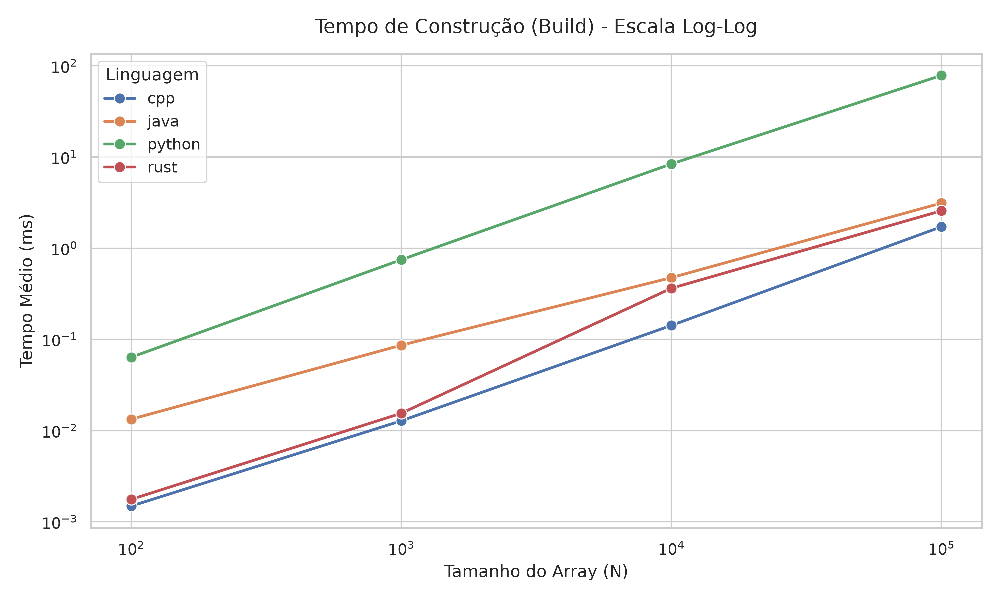

**Figura 1** – Tempo de Construção (Build) em Escala Log-Log
*Fonte: Elaborada pelos autores (2026).*

A Figura 1 apresenta o tempo médio de construção em função do tamanho da entrada N, em escala log-log. Esse tipo de escala é adequado para observar o comportamento assintótico, como a construção da Segment Tree percorre os N elementos do array de entrada para montar a estrutura, espera-se um crescimento de complexidade *O(n)*. Em um gráfico log-log, esse comportamento é representado aproximadamente por uma reta, cuja inclinação está relacionada ao expoente de crescimento. As quatro linguagens apresentam comportamento aproximadamente linear ao longo dos tamanhos avaliados (N = 10² a 10⁵), indicando que as implementações seguem comportamento assintótico esperado, independente da linguagem utilizada. Entretanto, em termos absolutos, as linguagens apresentam diferenças consideráveis. Para N = 100.000, o C++ construiu a árvore em aproximadamente 1,72 ms, o Rust em 2,57 ms e o Java em 3,13 ms, enquanto o Python levou 78,58 ms. Dessa forma, o Python apresentou um tempo de construção, aproximadamente, 46 vezes maior se comparado com o C++ e 25 vezes maior se comparado com o Java. A diferença se torna mais evidente conforme o tamanho da entrada aumenta, como mostra a escala linear da Figura 2.

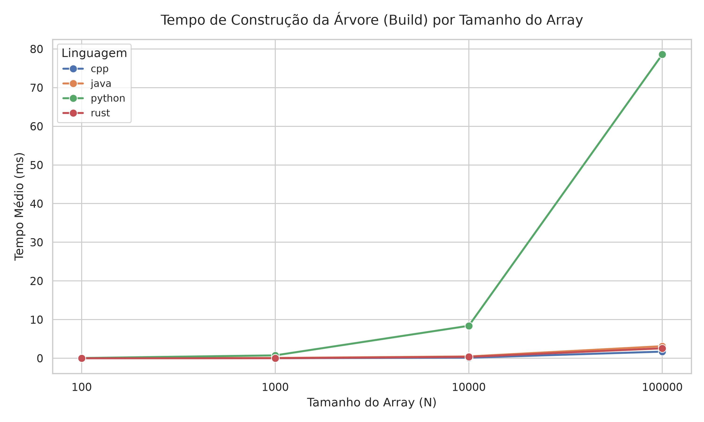

**Figura 2** - Tempo de Construção (Build) por Tamanho do Array
*Fonte: Elaborada pelos autores (2026).*

A partir de N = 10.000, o Python passa a dominar o gráfico, enquanto as demais permanecem próximas ao eixo horizontal, devido a diferença de escala.

Esse resultado é consistente com as características de execução das linguagens. Python executa o código através de uma máquina virtual baseada em bytecode, o que introduz maior overhead durante operações como atribuições, chamadas de funções e acessos aos elementos da estrutura. C++ e Rust, são compilados diretamente para código nativo, enquanto Java utiliza a JVM e JIT, que podem otimizar a execução durante o funcionamento do programa.

Assim, embora as quatro implementações apresentem o mesmo comportamento assintótico *O(n)*, seus custos constantes diferem de forma significativa.

#### 2.5.2 Desempenho das Operações em Lote

A avaliação do desempenho das operações em lote permite a observação de como a árvore de segmentos se comporta sobre as diferentes cargas de trabalho. A Figura 3 mostra a curva de tempo médio por operação para a carga de trabalho Update no lote de 5N, comparando as quatro linguagens utilizadas no projeto com relação ao limite teórico de complexidade *O(log N)*. Nos gráficos temos o eixo do tempo médio, medido em microssegundos (µs) e o eixo do tamanho do array (N). Outro aspecto relevante é que no eixo X os valores estão postos tendo por base o valor de 10⁵, representado pela notação "1e5", ou seja, o ponto 0.2 representa um tamanho de array igual a 0.2 x 10⁵, por exemplo.

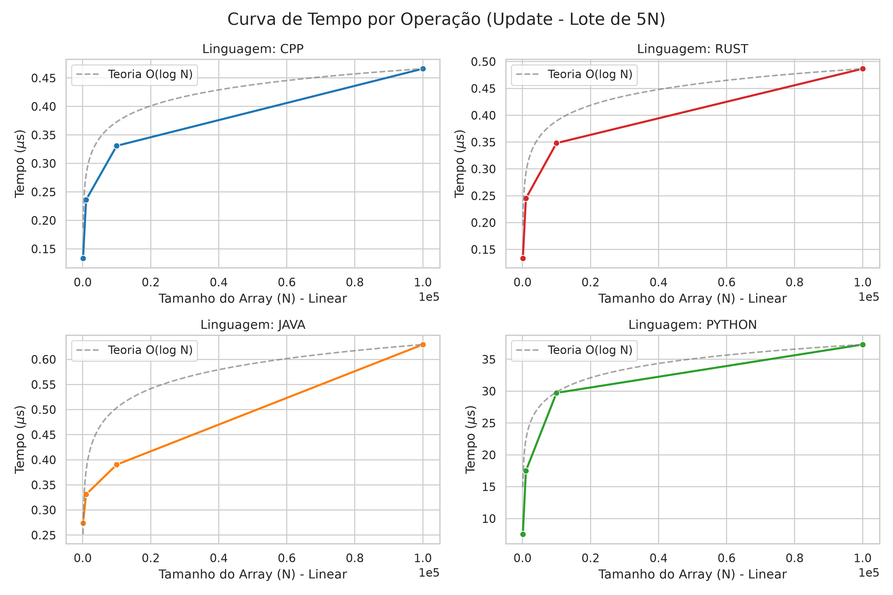

**Figura 3** - Curva de Tempo por Operação (Update - Lote de 5N)
*Fonte: Elaborada pelos autores (2026).*

Ao analisar os gráficos é possível observar que todas as quatro implementações mantêm um comportamento teórico esperado, de acordo com a proximidade das curvas experimentais em relação a de referência. Assim, validando a eficiência da implementação da Lazy Propagation, demonstrando que o algoritmo escala logaritmicamente independente da linguagem.

Em termos absolutos, é observável que nas implementações em Rust e C++ os custos computacionais por operação são menores, com tempos que variam entre 0,1 µs e 0,5 µs dado o intervalo de entrada avaliado. Isso se dá por serem linguagens de compilação direta para código de máquina e pela ausência de um coletor de lixo (garbage collector) ou sobrecarga da máquina virtual, alcançando dessa forma uma alta performance.

Na implementação em Java, o desempenho mostrado é próximo de C++ e Rust, com tempos próximos a 0,6 µs. Isso ocorre porque a sua execução na JVM otimiza o código enquanto o programa está rodando, garantindo alta velocidade após o período inicial de adaptação (warmup) mencionado na seção [2.3.3](#233-procedimento-de-medição).

Em Python, embora acompanhe o padrão de crescimento das outras, a implementação é consideravelmente a mais lenta, alcançando a faixa de tempo de 30µs a mais de 35 µs. Devido à natureza interpretada da linguagem, o que impacta a latência de cada operação, ela se torna significativamente menos eficiente que as outras linguagens para essa estrutura de dados específica.

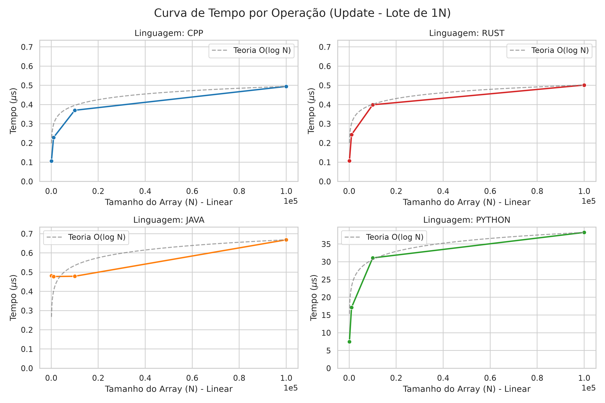

**Figura 4** - Curva de Tempo por Operação (Update - Lote de 1N)
*Fonte: Elaborada pelos autores (2026).*

De forma similar aos resultados obtidos com carga de maior intensidade, a Figura 4 apresenta o comportamento de tempo médio por operação para a carga de Update com um lote de 1N. Observa-se que as quatro implementações preservam o comportamento teórico, indicando que a redução no volume de operações por execução não altera a eficiência.

Assim, a ordem de desempenho entre as linguagens permanece a mesma. No entanto é importante destacar o comportamento do Java para entradas de menores tamanhos, a curva exibe um trecho quase horizontal inicialmente. Esse fenômeno em escalas reduzidas pode estar associado ao custo de inicialização e ao comportamento do JIT, onde o tempo de execução é pequeno demais para estabilizar o perfil de desempenho. Em outras palavras, isso pode ter ocorrido porque o número de execuções internas, necessárias para finalizar as operações relativas ao N = 100 e ao N = 1000, foi insuficiente para ativar as otimizações realizadas pelo JIT. É válido ressaltar que esse comportamento se repetirá em todos os gráficos de Java quanto às operações em blocos.

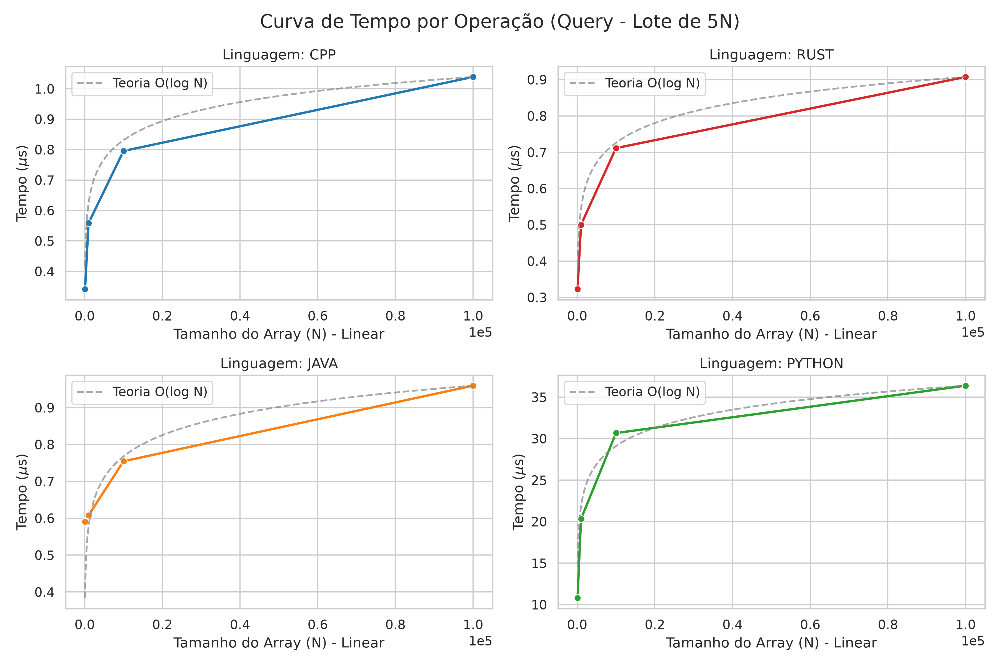

**Figura 5** - Curva de Tempo por Operação (Query - Lote de 5N)
*Fonte: Elaborada pelos autores (2026).*

A Figura 5 ilustra o desempenho para a operação de consulta utilizando um lote de 5N. De forma consistente com os resultados anteriores, todas as implementações permanecem com o comportamento logarítmo esperado.

Assim, mantendo uma hierarquia de eficiência entre as linguagens. As linguagens C++ e Rust sendo as com menores tempos de execução, seguidas pelo Java e Python continua sendo a com maiores tempos de execução, chegando a até 35 µs.

É observável que os tempos absolutos para as consultas são levemente superiores aos de atualizações, refletindo o fato que as atualizações são otimizadas pelas Lazy Propagation, enquanto as consultas podem necessitar de descidas completas pela árvore.

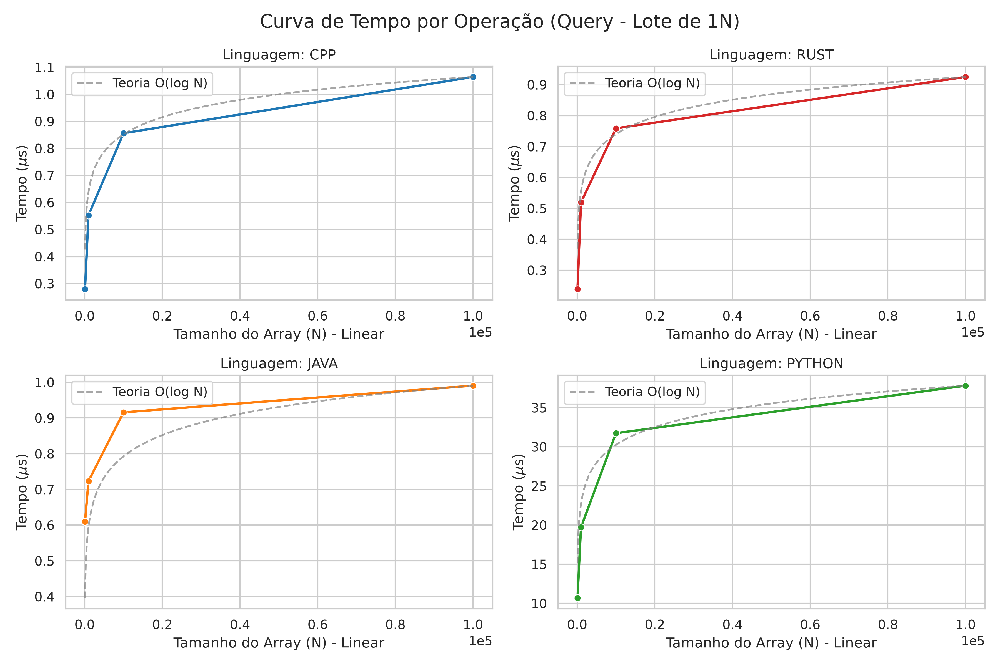

**Figura 6** - Curva de Tempo por Operação (Query - Lote de 1N)
*Fonte: Elaborada pelos autores (2026).*

Igualmente às análises das figuras anteriores, a Figura 6 apresenta o comportamento do tempo médio por operação para a carga de Query com um lote de 1N. Observa-se que as quatro linguagens continuam preservando o comportamento teórico esperado, assim, a redução no volume de operações por execução não altera a eficiência das consultas. Por consequente, a hierarquia, anteriormente citada, permanece inalterada.

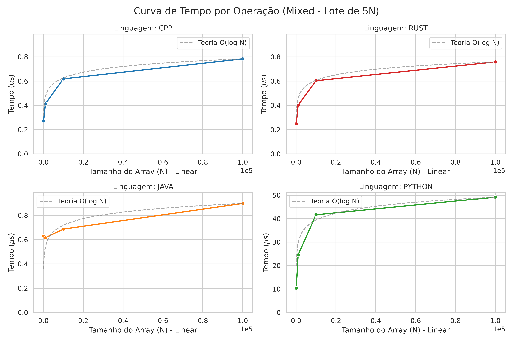

**Figura 7** - Curva de Tempo por Operação (Mixed - Lote de 5N)
*Fonte: Elaborada pelos autores (2026).*

A Figura 7 nos mostra o comportamento médio por operação para a carga de trabalho mista no lote de 5N, combinando as operações de atualização e consulta, executadas em uma ordem aleatória. Observa-se que todas as implementações preservam o comportamento logarítmico.

É importante ressaltar que Python opera nesse gráfico em uma grandeza de tempo consideravelmente superior, atingindo valores próximos a 50 µs para N = 10⁵, demonstrando o custo acumulado de diferentes operações sob a natureza interpretada da linguagem.

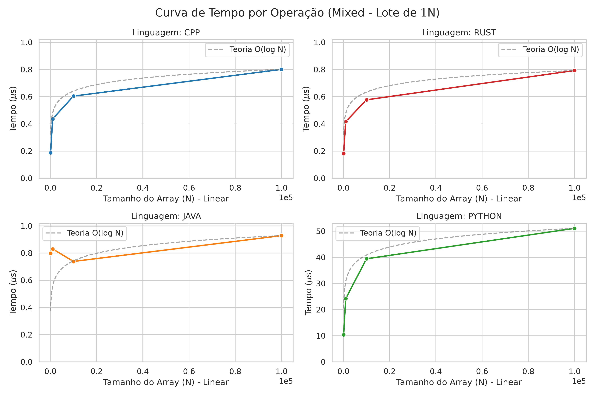

**Figura 8** - Curva de Tempo por Operação (Mixed - Lote de 1N)
*Fonte: Elaborada pelos autores (2026).*

A Figura 8 apresenta o comportamento do tempo médio por operação para a carga de trabalho mista com um lote de 1N. É observável que todas as implementações preservam o comportamento assintótico *O(log N)*, mostrando a consistência mesmo sob lotes com menores operações combinadas. A hierarquia de desempenho mantém-se igual com C++ e Rust com os menores tempos, Java com um tempo próximo a elas. mas com um tempo maior, chegando a até 1,0 µs e o Python continua sendo a linguagem que alcança os tempos maiores de execução, com valores que chegam a 50 µs para N = 10⁵, o que corrobora com a afirmação de que pela sua natureza interpretada há um custo computacional maior.

#### 2.5.3 Impacto das Distribuições dos Dados

As Figuras 9 a 12 apresentam o tempo médio por operação para N = 100.000, dividido pelas cinco distribuições de dados de entrada utilizadas no experimento: All Equal, Duplicates, Nearly Sorted, Random e Sorted. O objetivo dessa análise é verificar se a natureza dos valores armazenados no array exerce influência sobre o desempenho das implementações.

Os resultados indicam que a distribuição dos dados não produz variação relevante no tempo de execução dentro de uma mesma linguagem. Para as cargas de consulta, atualização e mista (Figuras 9 a 11), a amplitude entre a distribuição mais rápida e a mais lenta é inferior a 0,1 µs por operação em C++, Java e Rust, uma variação desprezível diante da escala de medição. Em Python, mesmo que a amplitude absoluta seja maior (até 5,64 µs na carga de atualização) ela representa uma oscilação de apenas 8% a 15% em torno da própria média, proporcionalmente equivalente à observada nas demais linguagens. O mesmo padrão se repete no tempo de construção (Figura 12): as médias por distribuição permanecem próximas dentro de cada linguagem, com Python variando entre 76,2 ms e 83,1 ms, e as barras de erro sobrepostas entre as cinco distribuições.

Esse resultado é coerente com o funcionamento da Segment Tree, com estrutura montada a partir dos índices do array, o número de nós percorridos e o formato da árvore resultante dependem exclusivamente de N e da posição dos intervalos consultados ou atualizados. Arrays ordenados, com duplicatas ou com valores repetidos não alteram a profundidade da árvore nem o caminho percorrido pela recursão, de modo que não há razão algorítmica para que a distribuição dos dados afete o desempenho.

A distribuição Random apresenta os maiores tempos médios em praticamente todas as combinações de linguagem e carga, por exemplo, 13,22 µs/op no Python (query) contra 10,92 µs/op em All Equal, e 1,83 ms de build C++ contra 1,68 - 1,71 ms nas demais distribuições. A diferença é pequena e não compromete a conclusão de estabilidade entre distribuições, mas é sistemática o suficiente para sugerir uma causa plausível: intervalos de consulta/atualização gerados aleatoriamente tendem a produzir padrões de acesso à memória menos previsíveis para o cache do processador do que sequências mais regulares, ainda que o número de nós visitados permaneça o mesmo.

Por fim, vale registrar que o Java exibe desvio padrão proporcionalmente maior que C++ e Rust no tempo de construção (em torno de 2,2 ms de desvio sobre uma média de aproximadamente 3 ms, contra desvios de 0,5 ms e 0,08-0,18 ms, respectivamente), visível nas barras de erro mais longas da série laranja na Figura 12. Esse comportamento é esperado mesmo após o período de aquecimento (warm up), sendo atribuído à atuação do coletor de lixo (garbage collector) da JVM, cuja execução pode ser de forma não determinística durante a repetição da medição.

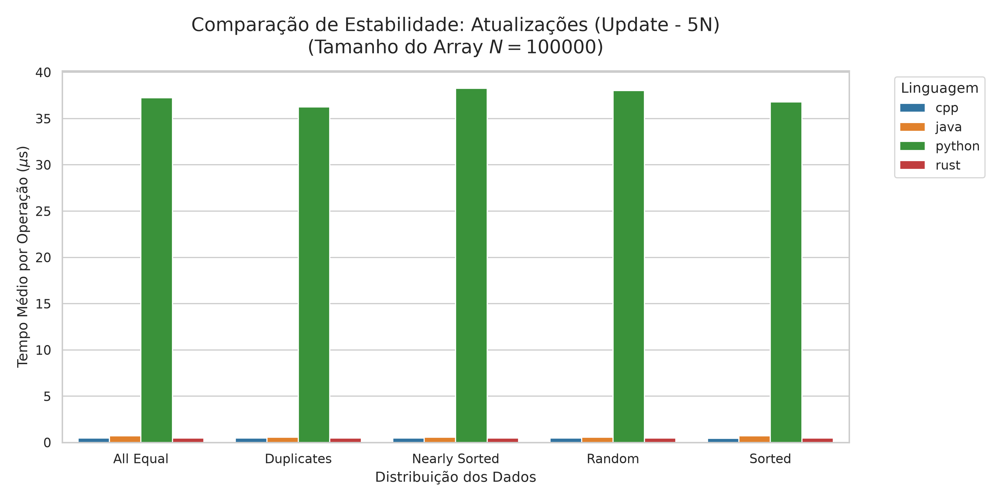

**Figura 9** - Comparação de Estabilidade: Atualizações (Update - 5N)
*Fonte: Elaborada pelos autores (2026).*

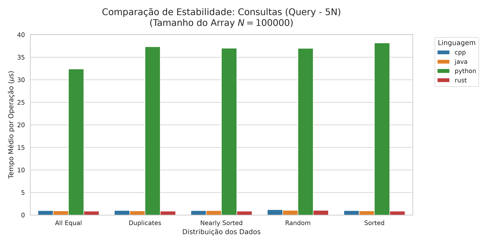

**Figura 10** - Comparação de Estabilidade: Consultas (Query - 5N)
*Fonte: Elaborada pelos autores (2026).*

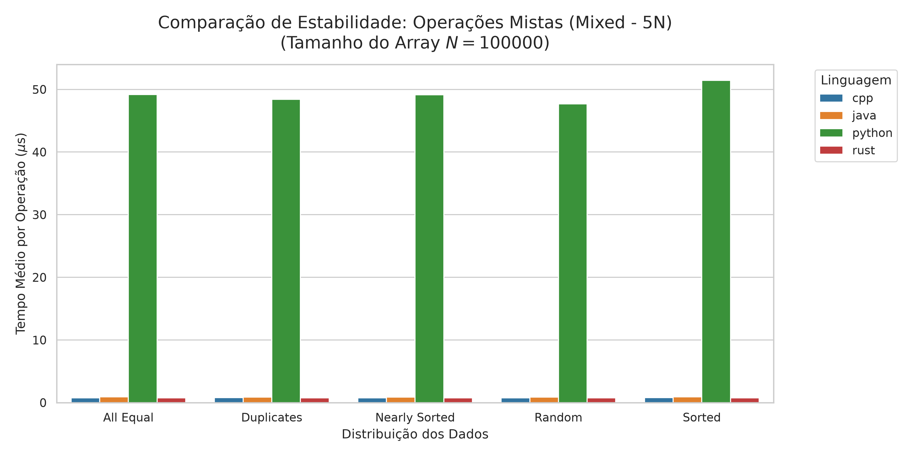

**Figura 11** - Comparação de Estabilidade: Operações Mistas (Mixed - 5N)
*Fonte: Elaborada pelos autores (2026).*

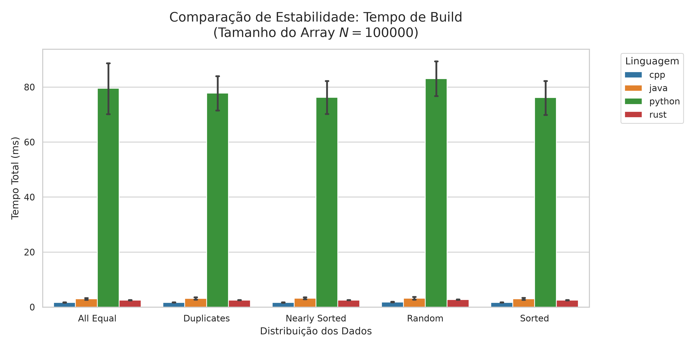

**Figura 12** - Comparação de Estabilidade: Tempo de Build
*Fonte: Elaborada pelos autores (2026).*

### 2.6 Ameaças à Validade

Para garantir a transparência e a correta interpretação dos resultados obtidos é necessário elencar algumas ameaças à validade deste experimento:

**a)** Implementações internas das linguagens: não se avalia o desempenho particular das estruturas de dados lineares nativas (array ou vetores) responsáveis por armazenar os nós da Segment Tree. Haja vista que diferentes linguagens de programação podem tratar as estruturas de dados de formas um pouco distintas.

**b)** Métricas de instruções primitivas: o número total de instruções primitivas executadas durante os testes não foi contabilizado. Essa métrica incluiria a quantidade exata de condicionais, atribuições a variáveis e acessos diretos à memória em cada operação. O escopo da análise se limitou ao tempo total de execução e ao número de nós visitados.

**c)** Agrupamento das operações de atualização: Embora existam dois tipos distintos de atualização na Segment Tree, a atualização de um nó específico (updatePoint) e a atualização de um intervalo (updateRange), não se mediu o tempo de execução isolado de cada um desses tipo. Consequentemente, nas cargas de trabalho, o custo computacional de ambas as operações estão agrupadas na métrica de atualizações totais.

## 3. Conclusões

Dado todos os dados, informações e experimentações citadas acima, os resultados permitem concluir de forma direta à pergunta de pesquisa proposta: a linguagem exerce impacto sobre o desempenho prático da estrutura, ainda que o comportamento assintótico seja preservado em todos os casos. Além disso, em todas as cargas de trabalho, Update, Query e Mixed, tanto no lote de 1N quanto no de 5N, bem como no tempo de construção da árvore, observou-se uma hierarquia de desempenho que demonstra que a linguagem mais rápida foi C++. Logo em seguida, com uma pequena diferença, temos Rust, provando que linguagens de compilação direta possuem uma vantagem no desempenho por traduzir diretamente para linguagem de máquina a implementação da estrutura de dados. Java fica mais atrás comparado a Rust, já que em sua execução, depende de máquina virtual ou coletor de lixo, o que justifica seus resultados serem levemente mais demorados que C++ e Rust. E por último, a linguagem Python possui um desempenho muito inferior comparado às três linguagens citadas, tornando evidente que a interpretação da linguagem interfere no tempo de execução.

Após a análise dos resultados, sobretudo dos gráficos das operações em lote, pode-se ressaltar também que o warm up de 5 execuções completas, realizado no main das linguagens, foi insuficiente para um devido "aquecimento" da JVM. Nessa mesma lógica, o tempo de execução dos dados menores foi insuficiente para ativar as otimizações realizadas pelo compilador JIT (Just-In-Time), responsável por garantir um bom desempenho à linguagem, desempenho este que pôde ser observado no tempo médio de execução para tamanhos de array com N = 10⁴ e com N = 10⁵.

Outro aspecto que é possível inferir a partir dos dados analisados é a estabilidade do desempenho frente às diferentes distribuições dos dados de entrada. Os resultados obtidos para os cinco tipos de distribuição avaliados (aleatória, ordenada, quase ordenada, com repetições e com valores iguais) mostraram-se praticamente equivalentes entre si, tanto para as operações de atualização e consulta quanto para o tempo de construção, em todas as quatro linguagens. Logo, a hierarquia de desempenho entre as linguagens é o fator mais fundamental nos resultados obtidos, permanecendo estável independentemente do padrão dos dados processados.

De modo geral, os resultados confirmam que a complexidade assintótica teórica, apesar de ser necessária, não é suficiente para prever o desempenho real de uma estrutura de dados. As particularidades de cada linguagem tais como presença ou ausência de máquina virtual, coletor de lixo, tipagem dinâmica ou estática e otimizações de compilador, mostraram-se determinantes na prática. Essa influência particular de cada linguagem no desempenho da Segment Tree é fundamentada pela igualdade do número de nós visitados por cada implementação, ou seja, o desvio padrão nulo na média dos nós visitados deixa claro o fato de que todas as árvores percorreram o mesmo caminho, dependendo apenas de suas particularidades para retornar o seu respectivo tempo de execução. Dessa maneira, C++ e Rust são as opções mais indicadas para cenários que demandam desempenho crítico. Java representa um equilíbrio razoável entre desempenho e portabilidade após o período de warm up da JVM e Python, embora tenha sua simplicidade e produtividade, mostra-se pouco recomendável para implementações da Segment Tree em que o tempo de execução seja crítico.

Por fim, as ameaças à validade apontadas que são a não avaliação das estruturas lineares internas de cada linguagem, a ausência de contagem de instruções primitivas e o agrupamento das atualizações pontuais e de intervalo em uma única métrica, delimitam a possibilidade de conclusões maiores, mas os resultados obtidos já podem inferir uma diferença de desempenho no tempo de execução de cada implementação da Segment Tree.

## Referências

CP-ALGORITHMS. Segment Tree. Disponível em: https://cp-algorithms.com/data_structures/segment_tree.html. Acesso em: 7 ago. 2026.

KLABNIK, Steve; NICHOLS, Carol. The Rust Programming Language. 2. ed. San Francisco: No Starch Press, 2023.

MERKEL, Dirk. Docker: lightweight Linux containers for consistent development and deployment. Linux Journal, Houston, v. 2014, n. 239, p. 2, mar. 2014.
